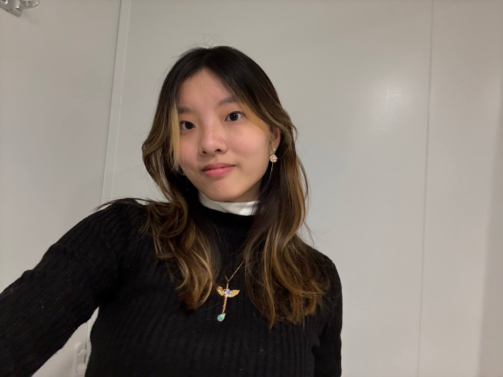
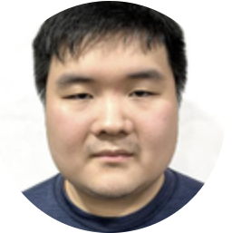
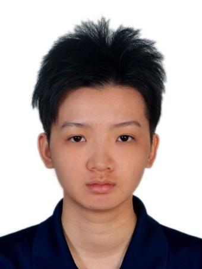

We are a team based in the [School of Computing, National University of Singapore](https://www.comp.nus.edu.sg).

You can reach us at the email `seer[at]comp.nus.edu.sg`

## Project team

### Neryss Ho

[[github](https://github.com/nrysho)]
[[portfolio](team/nrysho.md)]

* Role: Developer
* Responsibilities: UI

### Lim Zi Huan

[[homepage](https://www.comp.nus.edu.sg/~zihuan/)]
[[github](https://github.com/gluee003)]

* Role: Sweatshop Worker

### Jane Doe

[[github](http://github.com/johndoe)]
[[portfolio](team/johndoe.md)]

* Role: Team Lead
* Responsibilities: UI

### Johnny Doe

[[github](http://github.com/johndoe)] [[portfolio](team/johndoe.md)]

* Role: Developer
* Responsibilities: Data

### Jean Doe

[[github](http://github.com/johndoe)]
[[portfolio](team/johndoe.md)]

* Role: Developer
* Responsibilities: Dev Ops + Threading

### Chen Yoong Shee

[[github](http://github.com/ash-l7)]
[[portfolio](team/ash-l7.md)]

* Role: Developer
* Responsibilities: UI
